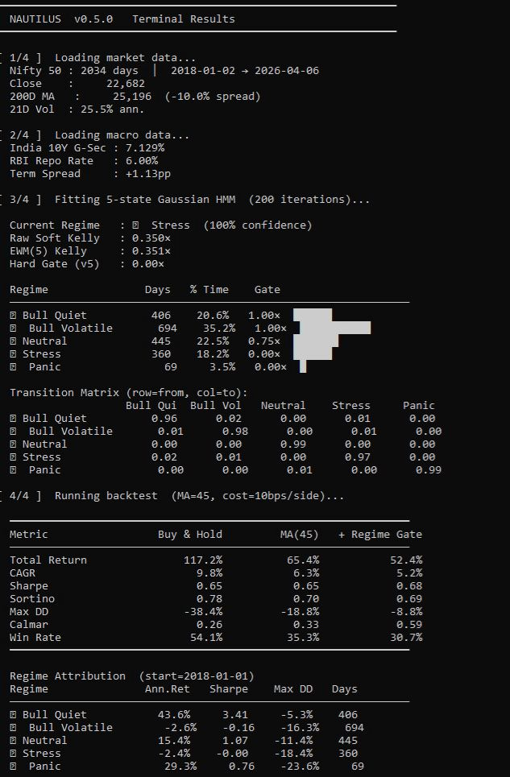

# NAUTILUS

**India Macro-Regime Platform** — 5-state Gaussian HMM · US macro overlay 

---

## What it does

Nautilus ingests Nifty 50 prices alongside Indian and US macro data, fits a 5-state Hidden Markov Model on price volatility and macro features, and renders a full-stack research dashboard for regime-aware strategy research.

**Core capabilities:**

- Fits a **5-state Gaussian HMM** on 21D vol, returns, vol-of-vol, drawdown, 10Y yield Δ, yield spread, RBI easing flag, and 200-DMA ratio
- Applies a **v5 Hard Regime Gate** — binary position scaling based on dominant HMM state, shifted +1D (no look-ahead)
- **Sharpened Soft Kelly** — EWM(5) exponential weighting for ~3-day signal response vs the old 21-day rolling lag
- **US Macro Monitor** — S&P 500 · 10Y−3M Treasury spread · Fed Funds Rate with aligned inversion-period shading across all three panels
- **Backtest engine** — MA(N) vs regime-filtered equity curves with divergence fill and drawdown comparison subplot
- **Regime attribution** — days, % time, ann. return, Sharpe, max DD per HMM state
- **Markov forward forecast** — N-day regime probability paths from current posterior
- **Monthly returns heatmap** and full CSV export

---

## Quickstart

```bash
# 1. Clone / extract
cd nautilus_v6

# 2. Create virtual environment (recommended)
python -m venv .venv

# Windows MSYS2 / PowerShell:
source .venv/Scripts/activate
# Linux / macOS:
source .venv/bin/activate

# 3. Install package (editable)
pip install -e ".[dev]"
pip install hmmlearn        # required for 5-state HMM

# 4. Run dashboard
streamlit run src/nautilus/dashboard/regime_dashboard.py
```

Dashboard opens at **http://localhost:8501**

---

## Dashboard panels

| Panel | Description |
|---|---|
| **KPI row** | Nifty 50 · DMA spread · HMM regime · Soft Kelly · 10Y G-Sec · RBI Repo · US 10Y−3M spread |
| **Regime distribution bar** | Colour-coded time allocation across 5 HMM states |
| **Nifty 50 · Regime Shading** | Price chart with HMM state bands + sharpened EWM(5) Kelly overlay |
| **Regime Probability Stack** | Stacked area chart of posterior probabilities per state |
| **Regime Forward Forecast** | Markov N-day probability paths from current state |
| **Soft Kelly — Sharpened** | EWM(5) vs MA(21) Kelly with hard gate overlay on secondary axis |
| **Monthly Returns Heatmap** | Year × month return grid |
| **Macro Panel** | India 10Y G-Sec yield + RBI repo rate + term spread |
| **US Macro Monitor** | S&P 500 · US 10Y−3M spread · Fed Funds Rate — inversion shading aligned across all three panels |
| **Volatility Panel** | 21D and 63D realised vol with p75/p90 regime bands |
| **Drawdown Panel** | Rolling drawdown from peak (optional toggle) |
| **Backtest** | MA(N) vs Regime-Filtered equity curves with divergence fill + drawdown subplot |
| **Regime Attribution** | Per-state statistics table + Markov transition matrix heatmap |
| **Signal Preview** | Live hard gate · soft Kelly · gated signal interactive calculator |
| **Data Exports** | Signal table · backtest summary · equity curves (CSV) |

---

## v5 Hard Gate logic

```
position(t) = base_signal(t) × hard_gate(t−1)

hard_gate(t) = f(argmax P(state | data₁..ₜ))
  🟢 Bull Quiet    → 1.00×   (full exposure)
  🔵 Bull Volatile → 1.00×   (still directionally long)
  🟡 Neutral       → 0.75×   (mild reduction)
  🟠 Stress        → 0.00×   (flat)
  🔴 Panic         → 0.00×   (cash)
```

All signals are pre-shifted +1D before entering the backtest engine. No look-ahead bias.

The hard gate produces a **measurable difference** vs a plain MA signal by zeroing positions entirely in Stress/Panic regimes — typically the 15–25% of time when drawdowns are largest.

---

## Sharpened Kelly

The dashboard exposes two Kelly variants:

| Variant | Lag | Use |
|---|---|---|
| **EWM(5)** | ~3 days | Primary signal — fast regime response |
| **MA(21)** | ~10 days | Reference — shown dotted in history panel |
| **Hard Gate** | 1 day (shift) | Binary 0/0.75/1.0 from dominant HMM state |

EWM(5) is computed as `soft_kelly.ewm(span=5, min_periods=3).mean()` and is also overlaid on the main Nifty price chart.

---

## US Macro Monitor

Three shared-x panels with **inversion-period shading aligned across all panels**:

1. **S&P 500** (`^GSPC`) — red vrect shading during yield curve inversion, drawdown annotations
2. **US 10Y−3M spread** (`^TNX − ^IRX`) — teal fill (normal) / red fill (inverted) with zero line
3. **Fed Funds Rate** — step-function from hardcoded policy anchors, ▲▼ markers at each FOMC decision

Inversion is defined as `US 10Y < 3M T-Bill`. Historically a leading recession indicator with 12–18 month lead time.

Fed Funds Rate uses hardcoded policy decision anchors forward-filled on business days — reliable even when `^FED` is unavailable via yfinance.

---

## Data sources

| Series | Ticker / Source | Cadence |
|---|---|---|
| Nifty 50 | `^NSEI` via yfinance | Daily |
| India 10Y G-Sec | `data/india_10y_yield.csv` | Bundled |
| RBI Repo Rate | `data/rbi_repo_rate.csv` | Bundled |
| US 10Y Treasury | `^TNX` via yfinance | Daily |
| US 3M T-Bill | `^IRX` via yfinance | Daily |
| S&P 500 | `^GSPC` via yfinance | Daily |
| Fed Funds Rate | Hardcoded policy anchors | Per FOMC meeting |


---

## Preview



---

## Project structure

```
nautilus_v6/
├── data/
│   ├── rbi_repo_rate.csv        # RBI repo rate history (public domain)
│   └── india_10y_yield.csv      # India 10Y G-Sec yield history
├── src/nautilus/
│   ├── __init__.py              # Version: 0.5.0
│   ├── config.py                # Paths, tickers, model defaults
│   ├── etl/
│   │   ├── loader.py            # yfinance download + Parquet cache
│   │   └── macro.py             # Macro feature pipeline (RBI, bond, HMM features)
│   ├── strategies/
│   │   ├── momentum.py          # MA signal, price-above-MA regime
│   │   └── regime.py            # HMM fitting, Markov forecast, regime containers
│   ├── backtests/
│   │   └── engine.py            # Vectorised backtest, metrics, equity curves
│   └── dashboard/
│       └── regime_dashboard.py  # Streamlit app (main entry point)
├── tests/
│   └── test_engine.py           # Backtest engine unit tests
└── pyproject.toml
```

---

## Updating data

**RBI repo rate** — after each MPC meeting, append a new row to `data/rbi_repo_rate.csv`:

```
2025-06-06,5.50
```

Then click **🔄 Refresh Data** in the sidebar to bust the Streamlit cache.

**India 10Y yield** — replace `data/india_10y_yield.csv` with an updated export from Investing.com (same column format: `Date,Price`).

---

## Sidebar controls

| Control | Default | Effect |
|---|---|---|
| Date Range | 2018-01-01 → today | Slices all data and charts |
| DMA Window | 200 days | Long-term trend filter line on price chart |
| HMM Iterations | 200 | EM convergence steps (higher = slower, more stable) |
| Forecast Horizon | 20 days | Markov forward path length |
| Macro features in HMM | On | Adds yield/repo/DMA-ratio features to HMM input |
| MA Window | 45 days | Base signal window for backtest |
| Transaction Cost | 10 bps | Applied per side in backtest engine |
| Regime Shading | On | Colour bands on price chart |
| Live Mode | Off | Auto-refresh every 60 seconds |
